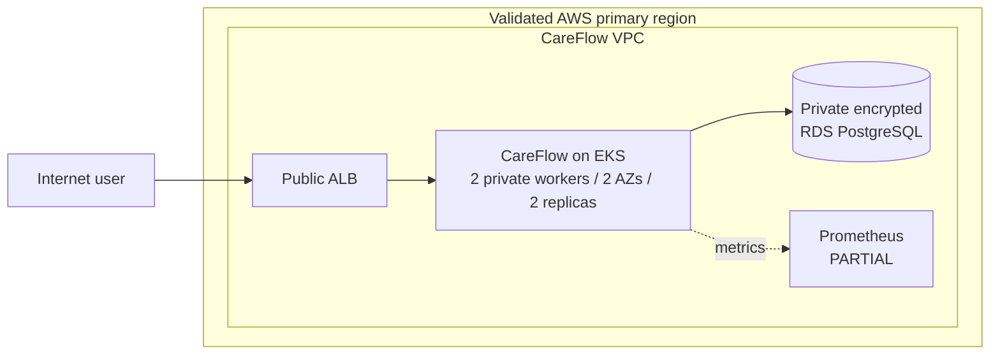

# Enterprise Multi-Region Cloud Platform

> A production-oriented AWS reference platform for **CareFlow**, a fictional regulated-healthcare SaaS workload. It is an independently authored public portfolio using synthetic data only—not a claim of production compliance.

## The problem

How do you design and operate a secure, highly available, production-oriented AWS platform that can deploy safely, protect data, recover from failed releases and remain cost-controlled?

This repository answers that question with two deliberately separate profiles:

- a **time-boxed demo profile** that exercises the real delivery and application path at low cost; and
- a **production target** that documents the stronger availability, retention, edge-security and recovery controls a regulated workload would require.

## What was built

- Terraform modules for a three-AZ VPC, private EKS workers, encrypted EBS, private PostgreSQL RDS, ECR, KMS and scoped IAM.
- GitHub Actions federation through repository/environment-scoped OIDC—no long-lived AWS keys in GitHub.
- Tested, Trivy-gated container publication to immutable ECR, followed by a digest-only promotion pull request.
- Argo CD GitOps with health-aware dependency ordering for External Secrets, AWS Load Balancer Controller, Kyverno, metrics-server, observability and CareFlow.
- RDS-managed credentials delivered by External Secrets, with runtime AWS identifiers kept outside the public Git tree.
- Security Groups for Pods using modern VPC CNI `CNINode`/`SecurityGroupsForPods` readiness, plus default-deny NetworkPolicy and hardened IMDSv2.
- ALB IP targets, dependency-aware `/readyz` health checks and a two-replica PostgreSQL-backed API.
- Prometheus application metrics/rules, a controlled broken-readiness rollout and GitOps rollback through Git revert.
- Explicit plan/apply/destroy gates, account/region checks, native remote-state locking and independent leftover audits.

## Executed AWS runtime proof

The final controlled validation proved this runtime path on AWS. Delivery, security ownership and resilience evidence are linked below.



| Evidence | Result |
|---|---|
| Reviewed Terraform execution | **PASS** — 89 created, 0 changed, 0 destroyed |
| EKS | **PASS** — two private `c7i-flex.large` workers Ready across two AZs |
| VPC CNI / pod networking | **PASS** — `CNINode`, `SecurityGroupsForPods`, `ENABLE_POD_ENI=true` and trunk ENIs verified |
| GitHub → ECR → GitOps | **PASS** — OIDC, tests, Trivy, immutable push and digest-only squash merge |
| CareFlow → RDS | **PASS** — migrations, synthetic CRUD and persistence after pod restart |
| ALB | **PASS** — two healthy targets; `/readyz` and API returned HTTP 200 |
| Observability | **PARTIAL** — metrics/rules worked; one of two pod scrape targets timed out cross-node |
| Failed rollout | **PASS** — **145/145 requests successful** while the bad revision stayed unready |
| GitOps rollback | **PASS** — prior digest and full health restored in **153 seconds** |
| Teardown | **PASS** — remote workload state returned to **0** and the independent inventory was empty |

The detailed, attempt-preserving record is in [`docs/aws-runtime-evidence.md`](docs/aws-runtime-evidence.md). Local container/PostgreSQL/kind evidence is in [`docs/runtime-evidence.md`](docs/runtime-evidence.md).

## Ownership boundaries

| Owner | Responsibility |
|---|---|
| Terraform | AWS networking, EKS, RDS, ECR, KMS, IAM and remote state |
| GitHub Actions | test, scan, OIDC authentication, immutable publication and digest promotion PR |
| Git-tracked manifests | portable Kubernetes desired state and generic placeholders |
| Ignored runtime patch layer | live VPC ID, RDS secret ARN, IAM role ARNs and private ECR repository URL |
| Argo CD | reconciliation of Git desired state plus the generated runtime-only patches |
| External Secrets | one-secret, workload-identity-based credential delivery into the cluster |

The runtime patch generator writes only beneath ignored `.runtime/`; repository guards reject live account/resource identifiers from tracked or staged files. See [`docs/architecture.md`](docs/architecture.md).

## Key engineering outcomes

1. **Least privilege from runtime evidence:** IAM evolved from exact CloudTrail/provider denials rather than speculative broad access; temporary teardown access was resource-scoped and removed.
2. **Keyless CI:** GitHub OIDC trust is restricted to the exact repository and `portfolio-publish` environment.
3. **Immutable delivery:** ECR immutability, digest-only promotion and Kyverno enforcement prevent mutable-tag deployment.
4. **Narrow data blast radius:** RDS is private and accepts PostgreSQL only from CareFlow pod branch ENIs—not the shared worker security group.
5. **Public-repository hygiene:** live AWS identifiers and credentials are injected locally at runtime, never committed for GitOps convenience.
6. **GitOps recovery:** the cloud rollback proof used Git revert, merge and Argo reconciliation rather than an imperative Kubernetes rollback.
7. **Safe remediation:** deterministic configuration defects were corrected in place without rebuilding healthy infrastructure or weakening IMDS/network controls.
8. **Lifecycle ownership:** the run ended with guarded teardown, zero Terraform workload resources and a service-by-service leftover audit.

## Demo profile versus production target

The validated demo is intentionally **not** the recommended regulated-production topology.

| Area | Validated `free-plan-demo` | Production target |
|---|---|---|
| Purpose | Short, synthetic, teardown-oriented validation | Persistent regulated-workload design |
| Workers | 2 × `c7i-flex.large` | 3 desired `t3.medium`, min 2/max 6; capacity must be load-tested |
| Database | Single-AZ `db.t4g.micro` | Multi-AZ database and separated migration/runtime identities |
| NAT | One shared NAT gateway | Per-AZ NAT where resilience/cost analysis justifies it |
| Backups | 1 day; no final snapshot | 7+ days, deletion protection and final snapshot |
| Edge | Time-boxed HTTP ALB proof | Domain-valid TLS, access logs and WAF/rate controls as justified |
| Observability | Focused ephemeral Prometheus | Durable telemetry, audit retention and routed alerts |
| Recovery | Release rollback executed | Cross-region data recovery and timed DR/failback drills |

## Known limitations

- **PARTIAL:** one Prometheus target had a cross-node timeout; the other target and required metrics/rules worked.
- **PARTIAL:** Kyverno enforced the digest policy, but its Argo applications retained chart/live-object convergence differences.
- **PENDING:** RDS managed-secret rotation recovery was not executed because the deployment role lacked the required rotation authorization; the rejected call did not change credentials.
- **PENDING:** trusted public TLS was intentionally not attempted without an owner-controlled domain and validated ACM certificate.
- **PENDING:** multi-region DR remains design-level; no cross-region data path, DNS failover or measured RTO/RPO is claimed.

## Repository guide

| Start here | Purpose |
|---|---|
| [`docs/architecture.md`](docs/architecture.md) | Implemented path, production target and ownership boundaries |
| [`docs/aws-runtime-evidence.md`](docs/aws-runtime-evidence.md) | Final AWS evidence plus preserved failed attempts |
| [`docs/security-threat-model.md`](docs/security-threat-model.md) | Trust boundaries, controls and residual risks |
| [`docs/rollout-rollback.md`](docs/rollout-rollback.md) | Local and cloud GitOps rollback mechanisms |
| [`docs/cost-controls.md`](docs/cost-controls.md) | Cost model and teardown controls |
| [`docs/disaster-recovery.md`](docs/disaster-recovery.md) | Explicitly unexecuted warm-standby target/runbook |
| [`docs/interview-story.md`](docs/interview-story.md) | Concise walkthrough and senior-level trade-offs |
| [`docs/implementation-status.md`](docs/implementation-status.md) | Authoritative capability/evidence ledger |

```text
apps/careflow-api/       synthetic PostgreSQL-backed service
infra/                   Terraform modules and guarded primary/DR roots
k8s/                     portable base plus local/production overlays
platform/                Argo CD, controllers, Kyverno and observability
bootstrap/aws/           remote-state and short-lived IAM bootstrap
.github/workflows/       quality, security, publication and plan workflows
scripts/                 preflight, runtime injection, evidence and teardown guards
```

## Safe reproduction

The default development path is cloud-free:

```bash
bash scripts/preflight.sh local
make local-demo
```

Terraform creates no workload resources unless `enable_cloud_resources=true`. CI never runs `terraform apply`; cloud creation requires an explicit owner authorization, a reviewed saved plan and exact account/region confirmation. Do not reuse historical plans. See [`docs/cloud-demo-runbook.md`](docs/cloud-demo-runbook.md).

## Portfolio integrity

CareFlow is fictional. This repository contains no real patient data, employer/customer infrastructure, proprietary code, credentials or secret values. It demonstrates engineering patterns, not automatic HIPAA or regulatory compliance. See [`DISCLAIMER.md`](DISCLAIMER.md) and [`SECURITY.md`](SECURITY.md).

## License

MIT. Third-party modules, charts, actions and tools retain their own licenses.
