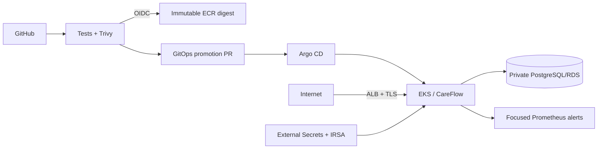

# Enterprise Multi-Region Cloud Platform

> A production-oriented reference platform for a **fictional regulated healthcare SaaS workload**. Built as a public engineering portfolio to demonstrate Cloud Architecture, Cloud Engineering, and Senior DevOps capabilities using only synthetic data and independently authored infrastructure.

## Why this repository exists

Most cloud portfolios prove that someone can deploy an application. This repository is intentionally different: it demonstrates how an experienced engineer thinks about **failure domains, blast radius, identity, observability, security, cost, recoverability, and operational ownership**.

The platform is designed around a fictional service called **CareFlow**, with no connection to any real employer, customer, architecture, codebase, data model, or internal system.

## Target roles demonstrated

- Cloud Architect
- Cloud Engineer
- Senior DevOps Engineer

## System goals

| Goal | Design target |
|---|---|
| Availability | Target: regional HA and multi-AZ production profile; cost-saving demo defaults are not HA |
| Recovery | Unproven objectives: RTO <= 60 min and RPO <= 15 min; no measured DR claim |
| Security | Private worker nodes, least privilege, policy-as-code, non-root containers |
| Deployments | GitOps-friendly, immutable container delivery, health-gated rollout |
| Observability | Metrics, logs, SLO-oriented alerts, synthetic health probes |
| Cost | Local-first development; DR and expensive resources disabled unless explicitly enabled |
| Data | Synthetic only; no PHI/PII or employer-derived information |

## Implemented architecture (in code; end-to-end cloud execution pending)



See [`docs/architecture.md`](docs/architecture.md) for separate implemented and target diagrams. DR, DNS failover, WAF, centralized audit, and signed-image admission appear only in the target diagram.


## Implementation status

| Capability | Status | Evidence / limitation |
|---|---|---|
| Multi-AZ VPC, EKS and private RDS Terraform | **IMPLEMENTED + PARTIAL AWS EVIDENCE** | First run reached an active EKS control plane, stopped on Free-plan restrictions, and tore down cleanly; workers/RDS never became available |
| Hardened Kubernetes workload and local kind workflow | **IMPLEMENTED + LOCAL PASS** | kind admitted the workload; failed readiness preserved 124/124 requests and rollback recovered |
| RDS application integration | **IMPLEMENTED IN CODE** | Pooling, migrations, TLS, readiness, rotation-aware secret file, and tests; cloud proof pending |
| Argo CD and required controllers | **IMPLEMENTED IN CODE** | Declarative bootstrap/application set; runtime reconciliation pending cloud execution |
| DR regional VPC/EKS scaffold | **PARTIALLY IMPLEMENTED** | Disabled by default; no DR database, application bootstrap or failover automation |
| ALB/TLS production ingress | **IMPLEMENTED IN CODE** | Controller IAM/chart and Ingress exist; valid TLS needs an existing domain/ACM validation |
| WAF, Route 53 and DNS health failover | **DOCUMENTED/PLANNED** | Deliberately excluded from this cost-sensitive vertical slice |
| Cross-region data recovery and measured drills | **PLANNED** | RTO/RPO are objectives, not demonstrated results |

See [`docs/implementation-status.md`](docs/implementation-status.md) for the authoritative capability ledger and [`docs/technical-review.md`](docs/technical-review.md) for the senior-level assessment.

The current code/design-versus-evidence rescore is in [`docs/milestone-3-review.md`](docs/milestone-3-review.md), with claim-by-claim status in [`docs/runtime-evidence.md`](docs/runtime-evidence.md).

The historical preflight is in [`docs/aws-preflight-review.md`](docs/aws-preflight-review.md), the safely failed execution in [`docs/aws-runtime-evidence.md`](docs/aws-runtime-evidence.md), and the redesigned sandbox profile in [`docs/free-plan-demo-review.md`](docs/free-plan-demo-review.md). None authorizes deployment.

## Production target and executed portfolio profile

The repository deliberately keeps two explicit configurations over the same modules:

- **Production target:** three desired `t3.medium` workers, per-AZ NAT, Multi-AZ RDS, at least seven days of backups, deletion protection, and a final snapshot. It remains the architecture requirement and is blocked from apply on this AWS Free account.
- **Free-plan demo:** two eligible x86 `c7i-flex.large` workers, one NAT gateway, Single-AZ RDS, and the account-constrained one-day backup setting. It is a deliberately bounded environment for proving GitHub → ECR → Argo CD → EKS → ALB → CareFlow → RDS, not a production claim.

The Free-plan profile preserves encryption, TLS, private networking, workload identity, managed credentials, policy enforcement and the same delivery path. Its reduced resilience and backup durability are explicit trade-offs, not silent changes to production requirements.

## Repository map

```text
.
├── apps/                         # Synthetic demo workload
│   └── careflow-api/
├── infra/
│   ├── modules/
│   │   ├── network/              # Multi-AZ VPC baseline
│   │   ├── eks/                  # EKS control plane + managed node groups
│   │   └── database/             # Encrypted PostgreSQL baseline
│   └── environments/
│       ├── primary/              # Primary regional deployment
│       └── dr/                   # Warm-standby reference deployment
├── k8s/
│   ├── base/                     # Portable Kubernetes resources
│   └── overlays/                 # Local and production overlays
├── platform/
│   ├── argocd/                   # GitOps application definitions
│   ├── kyverno/                  # Admission-control policies
│   └── observability/            # Prometheus/Grafana integration
├── docs/
│   ├── adr/                      # Architecture Decision Records
│   ├── architecture.md
│   ├── cost-controls.md
│   ├── disaster-recovery.md
│   ├── requirements.md
│   ├── reviewer-guide.md
│   ├── security-threat-model.md
│   └── interview-story.md
└── .github/workflows/            # CI, security and manually-gated cloud planning
```

## Local demo: ₹0 cloud cost

The default development path is deliberately cloud-free.

Prerequisites:

- Docker
- kind
- kubectl
- Python 3.12+
- OpenSSL (used only to generate the disposable local PostgreSQL credential)
- Trivy (the actual built image is scanned, not just the repository)

```bash
bash scripts/preflight.sh local
make local-demo
```

The helper builds/tests/scans the actual image, creates a random local-only database credential, runs disposable PostgreSQL, proves persistence across an application restart, rotates the local password, verifies metrics, and cleans up. If kind is installed, it also runs the continuous-traffic rollout failure and rollback drill. Redacted machine-readable evidence is written under ignored `artifacts/runtime-evidence/`.

## Cloud deployment safety

**Nothing in this repository auto-applies cloud infrastructure from CI.** The default primary Terraform configuration is also a no-op. Cloud creation requires `enable_cloud_resources=true`, a reviewed saved plan, an exact account/region confirmation phrase, and manual authorization. Follow [`docs/cloud-demo-runbook.md`](docs/cloud-demo-runbook.md); the abbreviated sequence is:

Account prerequisites are isolated under [`bootstrap/aws/`](bootstrap/aws/) and documented in [`docs/aws-bootstrap-runbook.md`](docs/aws-bootstrap-runbook.md). That path prepares an MFA-gated deployment role, separate EKS administrator, secure S3 state, and optional exact-repository GitHub OIDC publisher role; it does not authorize the main infrastructure apply.

```bash
export EXPECTED_AWS_ACCOUNT_ID='123456789012' AWS_REGION='us-east-1'
bash scripts/cloud-status.sh                    # read-only
bash scripts/cloud-plan.sh primary              # read-only; never applies
# bash scripts/cloud-apply.sh <reviewed-plan>    # billable; exact typed phrase required
# bash scripts/cloud-destroy.sh                  # destructive; separate exact phrase required
bash scripts/cloud-teardown-check.sh             # read-only
```

The DR environment defaults to `enable_dr = false` and is documented as an architecture capability rather than something that must stay running.

## Infrastructure as Code

The reference implementation uses current provider families, exact module releases, and committed provider lock files:

- Terraform AWS Provider `~> 6.59`
- terraform-aws-modules/VPC `6.7.0`
- terraform-aws-modules/EKS `21.25.0`
- EKS Kubernetes `1.36` by default

Versions are pinned/limited rather than floating to reduce surprise upgrades.

## Kubernetes platform

The workload includes:

- liveness and readiness probes
- startup probe and bounded rollout progress
- resource requests/limits
- HorizontalPodAutoscaler
- PodDisruptionBudget
- default-deny NetworkPolicy
- non-root runtime
- dedicated tokenless ServiceAccount
- read-only root filesystem
- dropped Linux capabilities
- topology spread constraints
- hash-suffixed generated configuration that triggers a rollout on change
- Prometheus scrape integration
- PostgreSQL-backed dependency readiness and a rotating mounted-secret contract

## Security by design

Repository controls include:

- no real secrets committed
- RDS-managed, automatically rotated master password rather than plaintext Terraform variables
- IRSA permission for one service account and one secret ARN; no static AWS keys
- a pod-specific RDS network identity rather than worker-node-wide reachability
- encrypted database storage
- Kubernetes `restricted` Pod Security labels
- Kyverno policies rejecting privileged/root workloads and mutable `:latest` tags
- a production-namespace Kyverno policy requiring image digests
- Argo-managed Kyverno controllers and policies, with admission enforcement scoped to the labelled CareFlow namespace
- strict Kubernetes schema validation in CI
- enforced Trivy repository, secret, IaC and built-image scanning
- every third-party GitHub Action pinned to an immutable commit
- cloud apply never runs automatically

See [`docs/security-threat-model.md`](docs/security-threat-model.md).

## Disaster recovery

The reference architecture is **active-primary / warm-standby** rather than active-active because the latter adds cost and consistency complexity that is not justified for the fictional requirements.

The DR **runbook and target design** cover:

- infrastructure recreation from Terraform
- GitOps workload reconciliation
- database backup/restore strategy
- DNS failover
- recovery validation
- controlled failback

The current code does not yet provide the cross-region data path or DNS controls needed to execute that design. See [`docs/disaster-recovery.md`](docs/disaster-recovery.md).

## Continuous integration

CI is intentionally separated into three concerns:

1. **Quality** — persistence tests, Terraform initialization/validation, Kustomize rendering and schema checks.
2. **Security** — secret-pattern checks, policy assertions, and enforced Trivy repository/container gates.
3. **Publication** — GitHub OIDC publishes a scanned immutable ECR image and opens a digest-only promotion PR.
4. **Cloud plan** — manual validation only; never applies infrastructure.

This separation makes the repository safe to fork and review without AWS credentials.

## Engineering decisions worth discussing in an interview

1. Why warm standby instead of active-active?
2. Why private worker nodes but a controlled public API endpoint for portfolio usability?
3. Why GitOps reconciliation rather than imperative production deployment?
4. Why database credentials are service-managed rather than passed into Terraform state?
5. Why cost guardrails are treated as an architecture requirement rather than an afterthought?
6. What changes would be required for actual PHI/PII handling and formal compliance?

Architecture Decision Records live under [`docs/adr/`](docs/adr/).

## Portfolio integrity / confidentiality statement

This repository is independently created for demonstration purposes. It contains **no proprietary code, copied architecture, screenshots, credentials, datasets, customer information, internal documentation, or confidential implementation details from any employer**.

See [`DISCLAIMER.md`](DISCLAIMER.md).

## Current maturity

**Milestone 1 — Foundation:** implemented.

- [x] project requirements and assumptions
- [x] architecture and ADRs
- [x] reusable Terraform modules
- [x] primary + DR environment scaffolds
- [x] synthetic containerized API
- [x] hardened Kubernetes base manifests
- [x] GitOps application skeleton
- [x] Kyverno controls
- [x] observability hooks
- [x] CI guardrails
- [x] cost and DR runbooks

**Milestone 2 — working vertical slice in code:** implemented; authorized cloud evidence is pending.

- [x] PostgreSQL persistence, pooling, TLS configuration, migrations, readiness, and tests
- [x] IRSA + External Secrets + RDS-managed rotation awareness
- [x] pod-level database network blast-radius control
- [x] immutable ECR publication through GitHub OIDC and digest promotion PR
- [x] Argo CD/controller bootstrap definitions and production application state
- [x] ALB/TLS ingress interface and focused Prometheus alerts
- [x] controlled readiness-failure/rollback drill and evidence template
- [x] explicit cloud cost opt-in, teardown checklist, and read-only leftover checker
- [x] sandbox AWS execution evidence captured; the first controlled run stopped at Free-plan constraints and was fully torn down

**Milestone 3 — execution safety and evidence discipline:** local runtime proof complete; cloud-dependent proof remains pending.

- [x] one-command local container/PostgreSQL/rotation/metrics evidence path
- [x] continuous-traffic kind failure and machine-readable rollback evidence
- [x] gated non-technical owner runbook with read-only/billable labels and teardown controls
- [x] separate code/design and executed-evidence scores
- [x] public evidence/redaction checklist and judgment-only senior review questions
- [x] Docker/PostgreSQL/kind runtime evidence, including rotation, failed rollout, zero failed continuous requests and rollback
- [x] authorized, time-boxed AWS attempt and verified same-session teardown; application runtime evidence remains pending

**Milestone 4 — owner-safe AWS bootstrap:** complete. One subsequent controlled validation attempt was stopped by AWS Free-plan restrictions and torn down; see [`docs/aws-runtime-evidence.md`](docs/aws-runtime-evidence.md).

- [x] cloud CLI toolchain and masked sandbox inventory checks
- [x] zero-change disabled plan and complete enabled review-only plan
- [x] actual-plan architecture, security, eight-hour cost and teardown review
- [x] local review plans made technically ineligible for the apply wrapper
- [x] short-lived sandbox role, remote state bucket, EKS administrator role and exact-repository GitHub OIDC prerequisite
- [x] final remote-backend plan generated and reviewed under the assumed deployment role
- [x] one explicit owner authorization consumed by the recorded controlled attempt; another apply requires new authorization

## License

MIT. Third-party Terraform modules and tools retain their own licenses.
