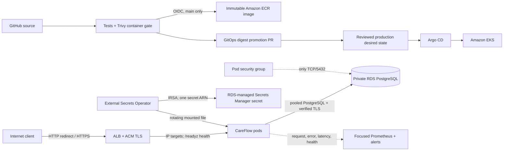
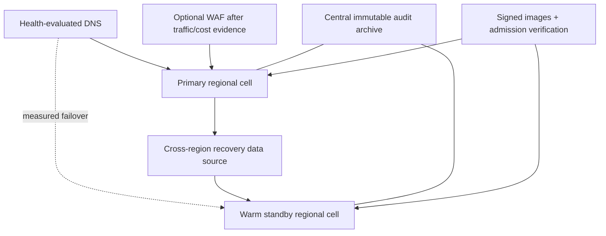

# Architecture

The diagrams deliberately separate code that now exists from future architecture. “Implemented” means the repository contains the integration and validation path; it does not by itself claim runtime success. The first AWS execution created part of the primary stack, stopped safely on Free-plan restrictions, and fully tore down the workload; the end-to-end runtime path remains pending.

## Explicit execution profiles

The same Terraform modules support two guarded profiles; they are not separate architectures.

| Setting | Production target | Free-plan demo |
|---|---|---|
| Purpose | Regulated-workload design target | Time-boxed sandbox validation only |
| Workers | Three desired `t3.medium` workers, min 2/max 6 | Two `c7i-flex.large` workers, min/desired 2 |
| Standard VPC-CNI capacity | 17 pods/node; production sizing must be load-tested | 29 pods/node; 58 total slots before system pods |
| RDS | Multi-AZ, at least 7-day backup retention, deletion protection, final snapshot | Single-AZ, 1-day retention, teardown-oriented controls |
| NAT | One per AZ | One shared NAT gateway |

`c7i-flex.large` is x86_64 and Free-plan eligible in this account. Two `t3.small` nodes were rejected during design review despite their lower price: each offers only 11 standard VPC-CNI pod slots and roughly 1.5 GiB allocatable memory, while the required system, GitOps, security, observability and two application replicas need about 28 steady-state pods. Two `c7i-flex.large` nodes provide roughly 3.34 GiB and 1.93 vCPU allocatable each, enough pod density and useful headroom without changing the application path. The one-day RDS retention is an AWS Free-plan execution constraint and is **not** the recommended production retention.

## IMPLEMENTED ARCHITECTURE

The implemented AWS path is a primary-region, synthetic-data portfolio slice. ECR uses immutable tags, the Kubernetes overlay pins a digest, and CI opens a pull request rather than changing the cluster. The default Terraform apply is a no-op until `enable_cloud_resources=true` is deliberately selected.

## TARGET ARCHITECTURE

The target diagram is not runtime evidence. Cross-region data recovery, DNS failover, WAF, centralized audit retention, artifact signing, and admission verification remain planned. The existing DR Terraform root is only a disabled VPC/EKS scaffold.

## Request and dependency behavior

- `/healthz` is process liveness and does not restart a healthy process merely because RDS is unavailable.
- `/readyz` runs a PostgreSQL query and migration check. Database loss removes a pod from Kubernetes and ALB endpoints.
- `/api/v1/appointments` returns synthetic IDs/statuses from PostgreSQL or a redacted HTTP 503. Production uses `verify-full` with a checksum-pinned AWS RDS global CA bundle in the image.
- A pool is bounded to five connections per pod. The mounted secret is fingerprinted; a new secret version replaces the pool without putting credentials in source, arguments, or ordinary environment variables.
- Schema migrations are ordered SQL files, serialized with a PostgreSQL advisory transaction lock, and recorded in `schema_migrations`.

## Failure domains and honest limitations

- Rolling updates keep at least one ready old pod because `maxUnavailable=0`; the controlled drill proves the failure and recovery procedure when executed.
- Two demo worker nodes across three configured AZs do not prove three-AZ compute availability. No cluster autoscaler is implemented.
- The Free-plan demo uses one NAT gateway and single-AZ RDS. It is explicitly not production HA. The production target retains per-AZ NAT and Multi-AZ RDS.
- RDS network ingress trusts only the CareFlow pod security group, not the shared worker-node group. VPC CNI network policy and security groups for pods use standard enforcement mode.
- The small observability profile retains three days in ephemeral Prometheus storage. It proves operational signals, not durable audit retention.
- The RDS-managed master credential is used to keep this slice small enough to demonstrate migrations and rotation. A real production design should split a privileged migration identity from a restricted runtime database role.

## Important architecture decisions

### PostgreSQL and migrations in the application image

- **Decision:** Use psycopg connection pooling and small SQL migrations serialized by a PostgreSQL advisory lock.
- **Why:** It proves a real stateful path without adding a migration platform.
- **Alternatives considered:** ORM/Alembic; a separate migration Job; in-memory demo data.
- **Trade-offs:** Simple and testable, but application startup owns DDL and uses a privileged credential.
- **Cost implication:** No additional service.
- **Operational implication:** Failed migrations keep readiness false; production should eventually separate migrator and runtime roles.

### IRSA plus External Secrets

- **Decision:** External Secrets uses a short-lived token for the CareFlow service account to read exactly one RDS-managed secret; the app receives a mounted file.
- **Why:** No static AWS key or secret value enters Git, Terraform variables, or pod environment output.
- **Alternatives considered:** EKS Pod Identity with controller-wide access; Secrets Store CSI Driver/ASCP; direct AWS SDK calls from the app.
- **Trade-offs:** ESO adds one controller and a Kubernetes Secret copy. The app itself has no AWS SDK dependency; the IRSA trust still belongs to its dedicated service account.
- **Cost implication:** ESO is compute-only; Secrets Manager charges for the managed secret and API calls.
- **Operational implication:** ESO refreshes every five minutes and the app recreates its pool when the mounted JSON changes. Rotation must be tested in cloud.

### Security groups for pods

- **Decision:** Assign CareFlow a branch-ENI security group and make RDS trust only that group.
- **Why:** The Milestone 1 node-security-group rule gave every pod on every worker network reachability to PostgreSQL.
- **Alternatives considered:** Dedicated node group; only Kubernetes NetworkPolicy; service mesh/egress proxy.
- **Trade-offs:** Better blast radius with added ENI capacity limits and pod-start latency.
- **Cost implication:** Security groups have no direct hourly charge; extra ENI/IP consumption can affect sizing.
- **Operational implication:** VPC CNI must have pod ENI enabled and pods must be recycled after mode changes.

### ECR publication and GitOps promotion

- **Decision:** GitHub OIDC publishes a scanned image to immutable ECR, then opens a digest-change PR.
- **Why:** It proves AWS federation and keeps the cluster reconciled only from reviewed Git state.
- **Alternatives considered:** GHCR; mutable tags; direct `kubectl set image` from CI.
- **Trade-offs:** ECR has small storage/API cost and requires AWS setup; promotion takes a reviewed merge.
- **Cost implication:** ECR storage and transfer are billed; lifecycle policy keeps only 20 images.
- **Operational implication:** Rollback is a Git revert to a known digest; the CI role has no Kubernetes permission.

### ALB and TLS without a required purchased domain

- **Decision:** Implement ALB IP targets, ACM certificate input, HTTPS redirect, and the TLS 1.2/1.3 policy; leave hostname optional.
- **Why:** It demonstrates the real AWS traffic path while allowing any existing validated domain.
- **Alternatives considered:** NLB; ingress-nginx; buying a portfolio domain.
- **Trade-offs:** Trusted TLS cannot be fully tested without control of a domain name and ACM validation. The ALB DNS name alone will not match a custom certificate.
- **Cost implication:** ALB hours/capacity units are billed; ACM public certificates are generally not the main cost driver.
- **Operational implication:** `/readyz` controls target health; a bad database removes targets, so at least two replicas matter.

### Focused Prometheus profile

- **Decision:** Run Prometheus Operator, one Prometheus and one Alertmanager; disable Grafana, node-exporter, and kube-state-metrics.
- **Why:** Request/error/latency/dependency signals and alerts prove the required maturity without an oversized demo stack.
- **Alternatives considered:** Full kube-prometheus stack; CloudWatch Container Insights; managed Prometheus.
- **Trade-offs:** No included dashboards and only ephemeral three-day retention.
- **Cost implication:** Uses existing worker capacity; no managed telemetry bill by default.
- **Operational implication:** Four alerts cover database loss, error ratio, p95 latency, and missing metrics; alert receivers are configured only at execution time.

### WAF deferred

- **Decision:** Do not attach WAF in Milestone 2.
- **Why:** There is no real threat/traffic evidence, and a baseline managed-rule attachment would add continuing cost without improving this synthetic short-lived demo materially.
- **Alternatives considered:** AWS managed common rules; a rate-based rule only.
- **Trade-offs:** The public demo relies on ALB/Kubernetes/application controls during the time-boxed window.
- **Cost implication:** Avoids WAF web ACL, rule, and request charges.
- **Operational implication:** Reconsider WAF before a persistent public deployment, based on actual abuse cases and a cost estimate.

### Explicit cloud opt-in

- **Decision:** All primary modules have zero instances unless `enable_cloud_resources=true`; CI never applies Terraform.
- **Why:** An accidental default apply must not create EKS, NAT, ALB, or RDS charges.
- **Alternatives considered:** Documentation-only warning; CI apply with environment approval.
- **Trade-offs:** Outputs are null in safe mode and live setup has an extra deliberate step.
- **Cost implication:** Default apply creates no billable AWS workload resources.
- **Operational implication:** Cloud execution is manual, reviewed, time-boxed, and followed by a read-only leftover scan.
